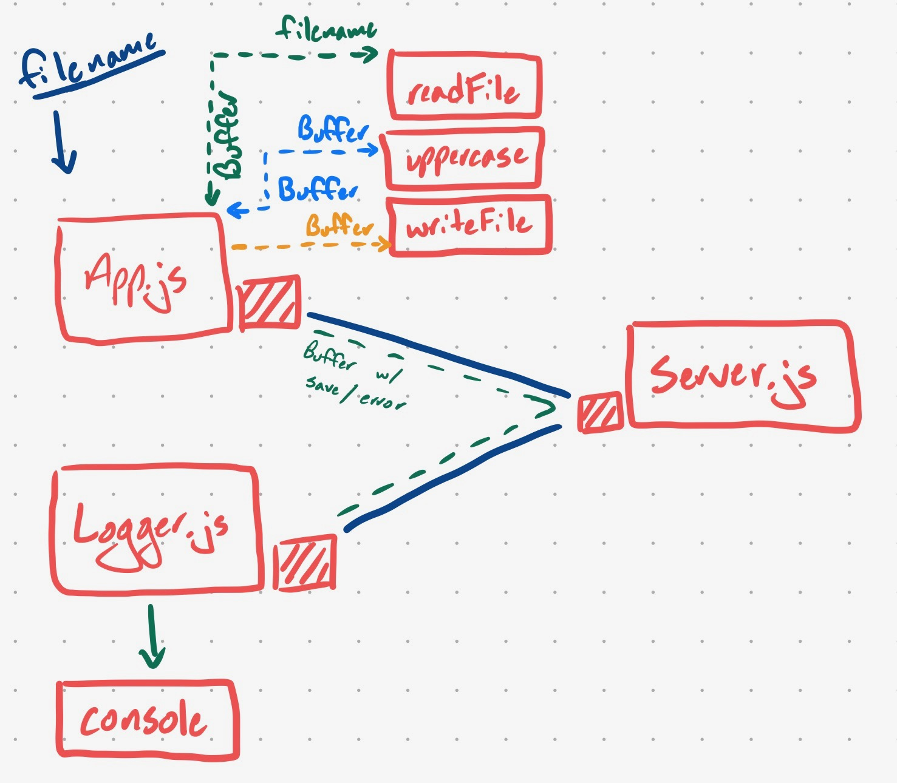

 LAB
=================================================

## TCP Server

### Author: Jagdeep Singh

### Links and Resources
* [submission PR](https://github.com/401-advanced-javascript-js/lab-17-tcp-server/pull/1)

### Setup
#### `.env` requirements
* `PORT` - Port Number, ex 3001

#### Running the app
* `node server.js`
* `node src/logger.js`
* `node app.js [:filename]`
  
#### Tests
No tests written, haven't gone over how to test sockets.

#### UML

